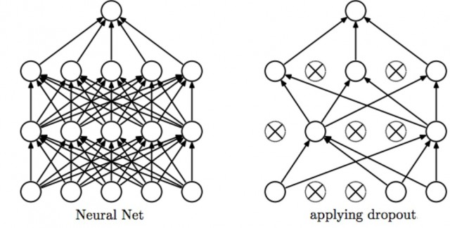

# cnn-image-classification-with-keras

# How to Run
#### Requirements
>
    python3
    keras
    pandas
    numpy
    matplotlib.plot
#### How to see parameters
>
    python3 main.py --help
>

    usage: main.py [-h] {training,prediction,splitting,plotting} ...

    Image Processing Project

    positional arguments:
    {training,prediction,splitting,plotting}

    optional arguments:
    -h, --help            show this help message and exit

#### How to split data to training and test set
> python3 main.py splitting

#### How to perform training
> python3 main.py training 

#### How to see training variables
>
    python3 main.py training --help
>
    Using TensorFlow backend.
    usage: main.py training [-h] [--epochs EPOCHS] [--batch-size BATCH_SIZE]
                            [--steps-per-epoch STEPS_PER_EPOCH]

    optional arguments:
    -h, --help            show this help message and exit
    --epochs EPOCHS
    --batch-size BATCH_SIZE
    --steps-per-epoch STEPS_PER_EPOCH

You can change the shown parameters like this:
> python3 main.py training --epochs 32

#### How to perform prediction

You have to put your images to Prediction folder. If there is no folder like this. The program will warn you to create it.

> python3 main.py prediction
Result should be like this for 1 image
>
    Prediction/example_pizza.jpeg
    Answer:  9
    Predicted: pizza
    pizza

# Explanations of Steps
## Split Training and Test Set
In this part of application, images in folder Dataset are splitting into parts in rate of desired value. In default it's 80% - training set,  20% test set.

Directory hierarchy is like this after splitting
>
    --->training
            ||
            ||---->butterfly
                    ||
                    ||--->image001.jpg, image002.jpg,....

    --->test
            ||
            ||---->butterfly
                        ||
                        ||--->image001.jpg, image002.jpg,....

## Training

CNN Model in this part we are using like this. You can change it in your desires:
    # conv => max pool => dropout => conv => max pool => dropout => fully connected (2 layer)

Keras libraries are used to build this model.

Dropout: Dropout is a technique where randomly selected neurons are ignored during training

Training step is can take a lot of time according to dataset size. So model and info about model is being saved to seperated files for future uses(like to predict images with created model)
#### Epoch and Batch Size
Assume that you have a dataset of 10 examples (or samples). You have a batch size of 2, and you've specified you want the algorithm to run for 3 epochs. Therefore, in each epoch, you have 5 batches (10/2 = 5). Each batch gets passed through the algorithm, therefore you have 5 iterations per epoch.
reference : https://stackoverflow.com/questions/4752626/epoch-vs-iteration-when-training-neural-networks

#### Data Augmentation
 To avoid overfitting problem, we need to expand artificially our dataset. Alter the training data with small transformations to reproduce the variations of images. For example, the car is not centered The scale is not the same. The image is rotated. ImageDataGenerator's parameters are hyperparameters. It can be set according to data and the results.
 >train_datagen = ImageDataGenerator(rescale​ = ​ 1.0​ / ​ 255​ , ​ shear_range​ = ​ 0.2​ , ​ zoom_range​ = ​ 0.2​ , ​ horizontal_flip​ = ​ True)

#### Step Logs in Training
You can see the accuracy and loss values when training action performed.
>
    Epoch 1/16
    32/32 [=======*] - 56s 2s/step - loss: 4.4368 - acc: 0.4382 - val_loss: 1.8855 - val_acc: 0.4292
    Epoch 2/16
    32/32 [=======*] - 56s 2s/step - loss: 1.3432 - acc: 0.6016 - val_loss: 1.6124 - val_acc: 0.5685
    Epoch 3/16
    32/32 [=======*] - 57s 2s/step - loss: 1.0990 - acc: 0.6582 - val_loss: 1.1177 - val_acc: 0.7374
    Epoch 4/16
    32/32 [=======*] - 56s 2s/step - loss: 0.9275 - acc: 0.7126 - val_loss: 0.9164 - val_acc: 0.7603
    Epoch 5/16
    32/32 [=======*] - 55s 2s/step - loss: 0.8592 - acc: 0.7508 - val_loss: 0.7677 - val_acc: 0.7854
    Epoch 6/16
    32/32 [=======*] - 56s 2s/step - loss: 0.7570 - acc: 0.7612 - val_loss: 0.6741 - val_acc: 0.8402
    Epoch 7/16
    32/32 [=======*] - 57s 2s/step - loss: 0.6795 - acc: 0.7910 - val_loss: 0.6298 - val_acc: 0.8082
    Epoch 8/16
    32/32 [=======*] - 57s 2s/step - loss: 0.6260 - acc: 0.8231 - val_loss: 0.5743 - val_acc: 0.8425
    Epoch 9/16
    32/32 [=======*] - 70s 2s/step - loss: 0.6303 - acc: 0.8105 - val_loss: 0.6314 - val_acc: 0.8699
    Epoch 10/16
    32/32 [=======*] - 68s 2s/step - loss: 0.5699 - acc: 0.8247 - val_loss: 0.5304 - val_acc: 0.8493
    Epoch 11/16
    32/32 [=======*] - 56s 2s/step - loss: 0.5148 - acc: 0.8436 - val_loss: 0.5142 - val_acc: 0.8516
    Epoch 12/16
    32/32 [=======*] - 55s 2s/step - loss: 0.5040 - acc: 0.8516 - val_loss: 0.5033 - val_acc: 0.8539
    Epoch 13/16
    32/32 [=======*] - 57s 2s/step - loss: 0.4961 - acc: 0.8485 - val_loss: 0.4333 - val_acc: 0.8790
    Epoch 14/16
    32/32 [=======*] - 57s 2s/step - loss: 0.4464 - acc: 0.8477 - val_loss: 0.3994 - val_acc: 0.8904
    Epoch 15/16
    32/32 [=======*] - 56s 2s/step - loss: 0.4749 - acc: 0.8475 - val_loss: 0.3994 - val_acc: 0.9018
    Epoch 16/16
    32/32 [=======*] - 56s 2s/step - loss: 0.4431 - acc: 0.8691 - val_loss: 0.4150 - val_acc: 0.8881

    Execution Time: 15.470373169581096 minutes

## Prediction
In this part you can test the images different than the dataset images. It uses saved model in training step
## Plotting
You can plot the model accuracy and model loss with the model info saved in training step. 

## Contributor(s)
Fatih Sarhan (f9n)
